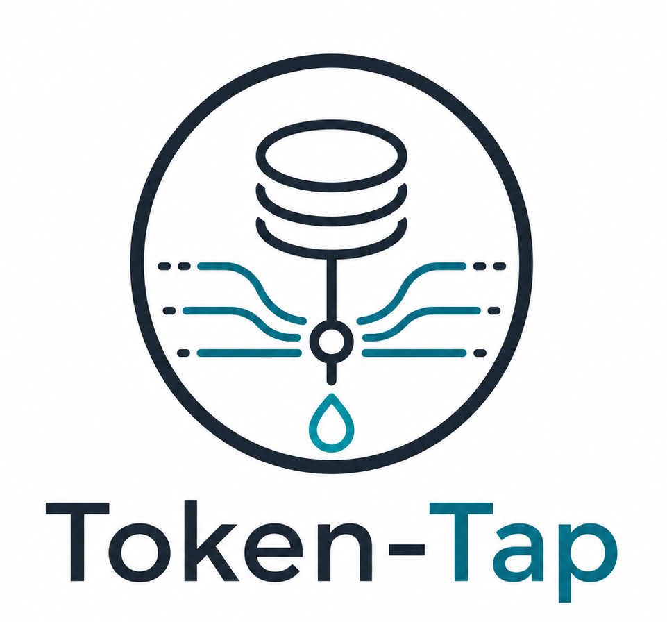
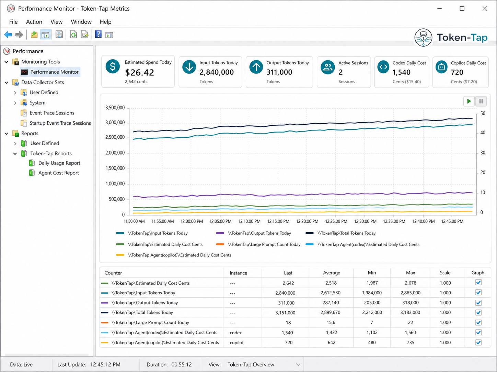

<p align="center">
  
</p>

# Token-Tap

Token-Tap is a local spend meter for AI coding tools.

It watches or imports Codex, GitHub Copilot, VS Code, OpenAI-style, Anthropic-style, CSV, and generic text logs; estimates token usage and cost; stores summarized history in SQLite; exports reports; evaluates simple alerts; and can publish live values to Windows Performance Counters.

The privacy default is intentionally conservative: Token-Tap stores metrics, hashes, and short redacted excerpts, not full prompts or responses.

## Release 1.000

Release `1.000` is the first public standalone release:

- `token-tap init`
- `token-tap detect`
- `token-tap watch`
- `token-tap import log|folder|csv`
- SQLite schema for sessions, events, aggregates, models, watched sources, cleanup, anomalies, and alerts
- configurable model pricing
- OpenAI JSON, Anthropic JSON, Codex/Copilot/generic text, and CSV parsers
- cost reporting for today, week, month, and rolling day ranges
- CSV and XLSX export
- retention cleanup with detail-to-aggregate rollups
- Windows Performance Counter install/list/test/publish hooks
- alert rule evaluation and alert history
- optional SMTP alert sender that reads the password from an environment variable
- wrapper mode: `token-tap run --agent codex -- <command>`
- xUnit test coverage for core, parser, storage, export, alert, counter, and CLI paths

## Windows Performance Monitor

Token-Tap can publish live values into Windows Performance Counters so PerfMon, PowerShell, and monitoring tools can watch AI spend and token burn without reading the SQLite history database.



Example counters:

```powershell
Get-Counter '\TokenTap\Estimated Daily Cost Cents'
Get-Counter '\TokenTap\Total Tokens Today'
Get-Counter '\TokenTap Agent(codex)\Estimated Daily Cost Cents'
```

Counter installation requires an elevated Windows shell:

```powershell
token-tap counters install
token-tap counters test
token-tap counters list
```

## Requirements

- .NET 8 SDK or newer
- Windows for Performance Counter publishing
- Elevated shell for `token-tap counters install` and `token-tap counters uninstall`

Core parsing, importing, reporting, SQLite storage, CSV/XLSX export, and tests do not require admin rights.

## Quick Start

Install from NuGet.org:

```powershell
dotnet tool install --global token-tap
token-tap --help
token-tap init
token-tap detect
token-tap watch --once
token-tap today
```

Update:

```powershell
dotnet tool update --global token-tap
```

Uninstall:

```powershell
dotnet tool uninstall --global token-tap
```

Build from source:

```powershell
dotnet build TokenTap.sln
dotnet test TokenTap.sln
dotnet run --project src/TokenTap.Cli -- init
dotnet run --project src/TokenTap.Cli -- detect
dotnet run --project src/TokenTap.Cli -- import log .\sample.log --agent codex --model gpt-5.4
dotnet run --project src/TokenTap.Cli -- today
dotnet run --project src/TokenTap.Cli -- export --today --format xlsx --out token-spend.xlsx
```

After publishing, the binary command name is expected to be `token-tap`.

```powershell
token-tap init
token-tap watch --once
token-tap report --week
```

## Configuration

Default config:

```text
%USERPROFILE%\.token-tap\token-tap.json
```

Default database:

```text
%USERPROFILE%\.token-tap\token-tap.db
```

Initialize somewhere explicit:

```powershell
token-tap init --config .\.token-tap\token-tap.json --database .\.token-tap\token-tap.db
```

See [docs/CONFIGURATION.md](docs/CONFIGURATION.md).

## Common Commands

```powershell
token-tap init
token-tap detect --save
token-tap watch-add "%APPDATA%\Code - Insiders\logs"
token-tap watch --publish-counters
token-tap import folder .\logs
token-tap import csv .\usage.csv
token-tap today
token-tap report --month
token-tap top --by cost --today
token-tap export --week --format csv --out token-spend.csv
token-tap cleanup --dry-run
token-tap cleanup --vacuum
token-tap db size
token-tap retention set events 14d
token-tap counters list
token-tap alerts test
```

See [docs/COMMANDS.md](docs/COMMANDS.md).

## Privacy

By default Token-Tap stores:

- timestamps
- agent/source/model
- token counts
- estimated cost
- confidence level
- hashes
- short redacted excerpts

By default Token-Tap does not store:

- full prompts
- full responses
- raw logs
- source code contents
- private chat history
- SMTP passwords

See [docs/PRIVACY.md](docs/PRIVACY.md).

## Repository Layout

```text
src/
  TokenTap.Cli/       command routing and user workflows
  TokenTap.Core/      config, privacy, costing, common models
  TokenTap.Parsers/   parser plugins and CSV import
  TokenTap.Storage/   SQLite schema, queries, cleanup
  TokenTap.Export/    CSV and XLSX reports
  TokenTap.Alerts/    alert rules, console and SMTP notification
  TokenTap.Counters/  Windows Performance Counter adapter
tests/
  TokenTap.Tests/     xUnit tests
docs/
  *.md                architecture, config, commands, privacy, development
```

## Development

```powershell
dotnet restore TokenTap.sln
dotnet build TokenTap.sln
dotnet test TokenTap.sln
```

See [docs/DEVELOPMENT.md](docs/DEVELOPMENT.md) and [docs/ARCHITECTURE.md](docs/ARCHITECTURE.md).

## Release

Token-Tap is ready for public GitHub CI. The included workflow builds and tests on Windows and Ubuntu using .NET 8.

See [docs/RELEASE.md](docs/RELEASE.md).

## GitHub Images

The checked-in logo is [docs/assets/token-tap-logo.png](docs/assets/token-tap-logo.png). A copy is also stored at [.github/social-preview.png](.github/social-preview.png) for use as the repository Social preview image in GitHub Settings.

## License

MIT. See [LICENSE](LICENSE).
